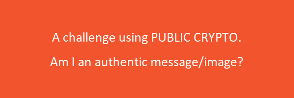
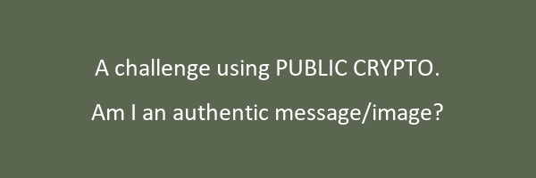

# Sigurnost Računala i Podataka

# 3**. Laboratorijska vježba**

### ***Message authentication and integrity***

November 2, 2021 

**Cilj vježbe je primjeniti teoreteske spoznaje o osnovnim kritografskim mehanizmima za autentikaciju i zaštitu integriteta poruka u praktičnom primjerima. Pri tome ćemo koristiti simetrične i asimetrične krito mehanizme**

- *message authentication code (MAC)*
- *digitalne potpise*

 **zasnovane na javnim ključevima.**

### ***Izazov 1***

**Implementirajte zaštitu integriteta sadržaja dane poruke primjenom odgovarajućeg *message authentication code (MAC)* algoritma. Koristite pri tome HMAC mehanizam iz Python biblioteka `[cryptography](https://cryptography.io/en/latest/hazmat/primitives/mac/hmac/)`.**

**Na početku se stvara virtualno okruženje u Pythonu imena `env` u radnom direktoriju**

```bash
python -m venv env
```

---

<aside>
💡 Ukoliko se javi error:
*.\activate : File C:\Users\mateo\Desktop\Vjezba3\env\Scripts\Activate.ps1 cannot be loaded because running scripts is disabled on this system.*
Potrebno je pokrenuti terminal u administrativnom modu i pokrenuti slijedeći kôd

</aside>

```bash
Set-ExecutionPolicy RemoteSigned
```

---

**Zatim se ulazi u radni direktorij `Scripts` te se pokrene datoteka `activate`**

```bash
cd env
cd .\Scripts
.\activate
```

**U početnom direktoriju, gdje se nalazi stvoreno okruženje, instalira se paket `cryptography`**

```bash
pip install cryptography
```

**Pokreće se, u istom direktoriju, Visual Studio Code**

```bash
code .
```

**Unutar VSC se otvori nova datoteka naziva `message_integrity.py` i napiše se slijedeći kôd za provjeru integriteta poruka**

```python
import os
from cryptography.hazmat.primitives import hashes, hmac
from cryptography.exceptions import InvalidSignature

def generate_MAC(key, message):
    if not isinstance(message, bytes):
        message = message.encode()

    h = hmac.HMAC(key, hashes.SHA256())
    h.update(message)
    signature = h.finalize()
    return signature

# mac je signature

def verify_MAC(key, signature, message):
    if not isinstance(message, bytes):
        message = message.encode()

    h = hmac.HMAC(key, hashes.SHA256())
    h.update(message)
    try:
        h.verify(signature)
    except InvalidSignature:
        return False
    else:
        return True

if __name__ == "__main__":

    key = "stankovic_mateo".encode()

    for ctr in range(1, 11):

        msg_filename = f"order_{ctr}.txt"
        sig_filename = f"order_{ctr}.sig"

        print(msg_filename)

        msg_filename_path = os.path.join(f"C:\\Users\mateo\Desktop\Vjezba3\env\challenges\stankovic_mateo\mac_challenge", msg_filename)
        sig_filename_path = os.path.join(f"C:\\Users\mateo\Desktop\Vjezba3\env\challenges\stankovic_mateo\mac_challenge", sig_filename)

        with open(msg_filename_path, "rb") as file:
            message = file.read()

        with open(sig_filename_path, "rb") as file:
            signature = file.read()

        is_authentic = verify_MAC(key, signature, message)

        print(f'Message {message.decode():>45} {"OK" if is_authentic else "NOK":<6}')
```

**Dobiven je output:**

order_1.txt
Message    Sell 84 shares of Tesla (2021-11-21T18:22) NOK
order_2.txt
Message     Buy 51 shares of Tesla (2021-11-18T18:51) OK
order_3.txt
Message     Buy 77 shares of Tesla (2021-11-15T20:00) NOK
order_4.txt
Message     Buy 10 shares of Tesla (2021-11-19T04:15) OK
order_5.txt
Message     Buy 22 shares of Tesla (2021-11-19T02:44) OK
order_6.txt
Message    Sell 83 shares of Tesla (2021-11-17T16:49) NOK
order_7.txt
Message      Buy 6 shares of Tesla (2021-11-16T05:26) OK
order_8.txt
Message    Sell 39 shares of Tesla (2021-11-15T21:00) NOK
order_9.txt
Message    Sell 89 shares of Tesla (2021-11-16T17:37) NOK
order_10.txt
Message    Sell 55 shares of Tesla (2021-11-22T09:02) NOK

**Iz outputa se vidi da nije u potpunosti ispravan redosljed transakcija sa odgovarajućim dionicama.**

### **Digital signatures using public-key cryptography**

**U ovom izazovu treba se odrediti autentična sliku (između dvije ponuđene) koju je profesor potpisao svojim privatnim ključem. Odgovarajući javni ključ dostupan je na gore navedenom serveru.**

**Javni ključ:**

```python
-----BEGIN PUBLIC KEY-----
MIIBIjANBgkqhkiG9w0BAQEFAAOCAQ8AMIIBCgKCAQEAwjbm0k3iQvq4JaCgRAUQ
8/qevvVmZCoD5aKdL8OoGoP7C44BJKhmkdPptP2ziYhFCsdTtU83q+sy8RChqYE2
vWA2nAqpytL9GUqysewLtwh90rco1gq2rDcyETQhEX2kMvfHGgGKuPv9y7kxAcCv
0H9jRTUnYhzIjFX2CWaXzS96IfnszFODuiB9IATxFX8UGB6LPomKlsODaDo0quAe
iDgW1vHj6D7REWY2EWsWiD/V3bGBO/QH7to7GW0sZGrb+eCmkOdqB1Vbn7ro0RzJ
N7n60pIwQs/04QfVtEszUWHWMf2ia53rGU0/0p+B+AfZqRgMEibSb/NWrquBv2Nt
mQIDAQAB
-----END PUBLIC KEY-----
```

**Slike i odgovarajući digitalni potpisi nalaze se u direktoriju `prezime_ime\public_key_challenge`.** 

**Za provjeru digitalnog potpisa se stvori *file* `digital_signature.py` u kojem će se nalaziti sljedeći kôd (napisan za sliku 1)**

```python
from cryptography.hazmat.primitives import serialization
from cryptography.hazmat.backends import default_backend

from cryptography.hazmat.primitives.asymmetric import padding
from cryptography.hazmat.primitives import hashes
from cryptography.exceptions import InvalidSignature

def load_public_key():
    with open("public.pem", "rb") as f:
        PUBLIC_KEY = serialization.load_pem_public_key(
            f.read(),
            backend=default_backend()
        )
    return PUBLIC_KEY

def verify_signature_rsa(signature, message):
    PUBLIC_KEY = load_public_key()
    try:
        PUBLIC_KEY.verify(
            signature,
            message,
            padding.PSS(
                mgf=padding.MGF1(hashes.SHA256()),
                salt_length=padding.PSS.MAX_LENGTH
            ),
            hashes.SHA256()
        )
    except InvalidSignature:
        return False
    else:
        return True

print(load_public_key())

# Reading from file
with open("env\challenges\stankovic_mateo\public_key_challenge\image_1.sig", "rb") as file:
    signature = file.read()

with open("env\challenges\stankovic_mateo\public_key_challenge\image_1.png", "rb") as file:
    image = file.read()

    is_authentic = verify_signature_rsa(signature, image)
    print(is_authentic)
```

**Provjeravaju se sljedeće slike:**

***Slika 1.***



i

***Slika 2.***



**Provjeravajući sliku sa odgovarajućim digitalnim potpisom, za sliku 1 se dobije ispis *true,* a za sliku 2 *false.***

**Stoga se zaključuje da je *slika 1* autentična.**